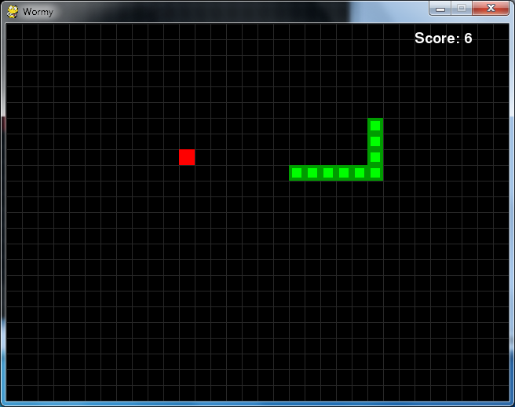

# WORMY
A WORMY(nibbles clone) game made using [python-pygame](http://www.pygame.org)

How-to
------

1. Install Python 2.7.X from [here](https://www.python.org/download/releases/)

2. Install PyGame 1.9.X from [here](http://www.pygame.org/download.shtml)

3. Clone this repository: `git clone https://github.com/Arjav96/Wormy.git` or click `Download ZIP` in right panel and extract it.

4. Run `python Wormy.py` from the repo's directory

  (Note: Install pygame for same version python as above)

  (For x64 windows, get exe [here](http://www.lfd.uci.edu/~gohlke/pythonlibs/#pygame))
  
How to Play Wormy
-------------------

Wormy is a Nibbles clone. The player starts out controlling a short worm that is constantly moving around the screen. The player cannot stop or slow down the worm, but they can control which direction it turns. A red apple appears randomly on the screen, and the player must move the worm so that it eats the apple. Each time the worm eats an apple, the worm grows longer by one segment and a new apply randomly appears on the screen. The game is over if the worm crashes into itself or the edges of the screen.
Enter any key to start. Use arrow keys (or WASD) to move the worm in desired direction.

ScreenShot
----------

